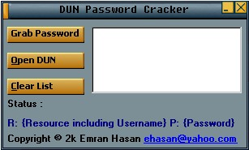



## DUN Password Cracker \(See Screen Shot \! \! \!\)

### Description

It grabs the Dial-Up Networking passwords that are saved with the Save Password checkbox. Very easy to understand. Has a kool interface .
 
### More Info
 

             |
---                |---
**Submitted On**   |2000-10-07 21:39:18
**By**             |[Md Emran Hasan](https://github.com/Planet-Source-Code/PSCIndex/blob/master/ByAuthor/md-emran-hasan.md)
**Level**          |Intermediate
**User Rating**    |4.1 (29 globes from 7 users)
**Compatibility**  |VB 4\.0 \(16\-bit\), VB 4\.0 \(32\-bit\), VB 5\.0, VB 6\.0
**Category**       |[Miscellaneous](https://github.com/Planet-Source-Code/PSCIndex/blob/master/ByCategory/miscellaneous__1-1.md)
**World**          |[Visual Basic](https://github.com/Planet-Source-Code/PSCIndex/blob/master/ByWorld/visual-basic.md)
**Archive File**   |[CODE\_UPLOAD104671072000\.zip](https://github.com/Planet-Source-Code/md-emran-hasan-dun-password-cracker-see-screen-shot__1-11923/archive/master.zip)

